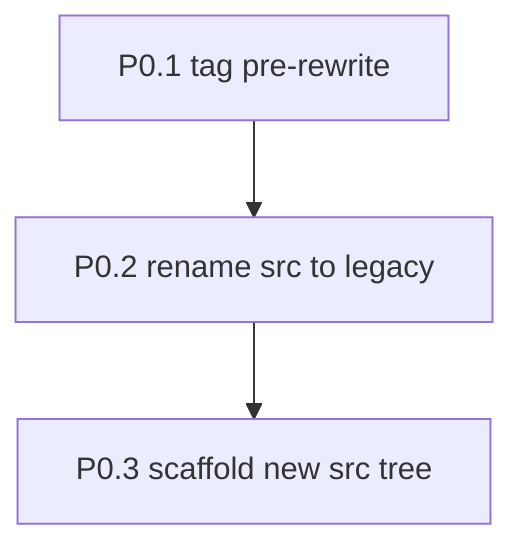
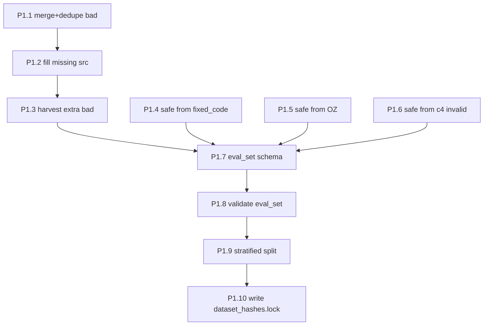
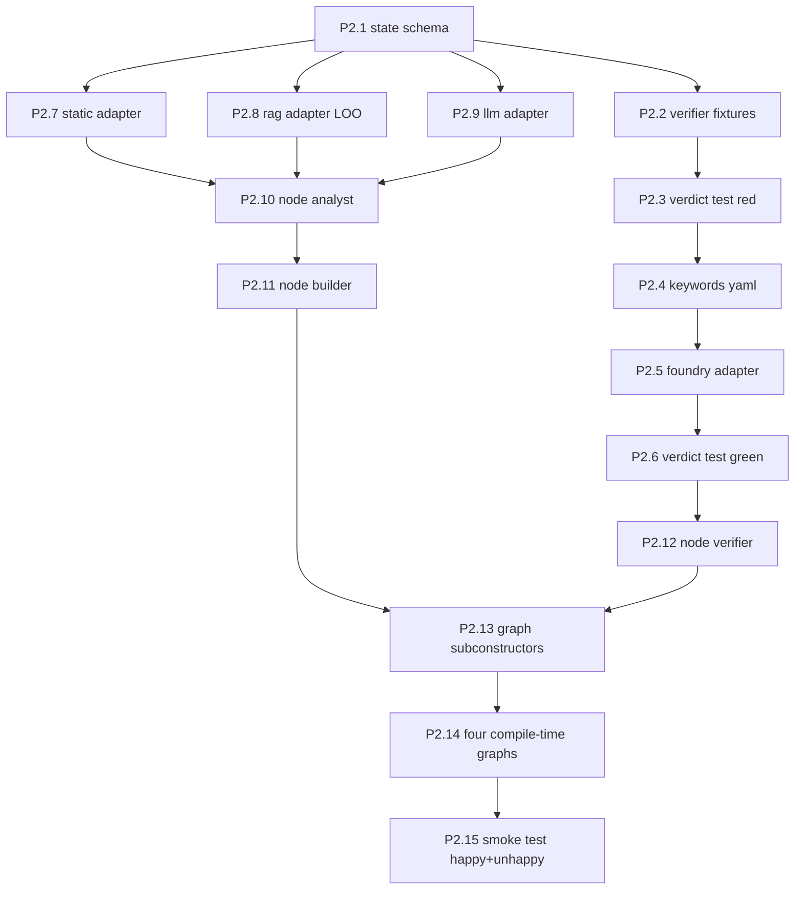
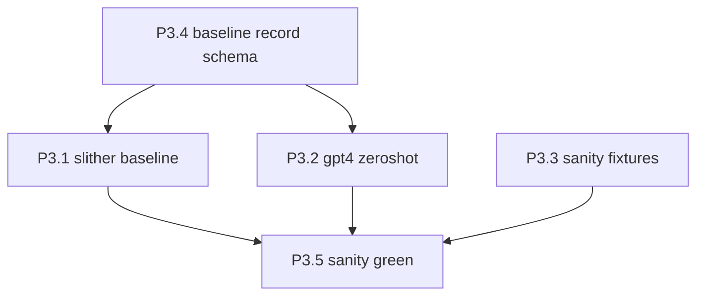
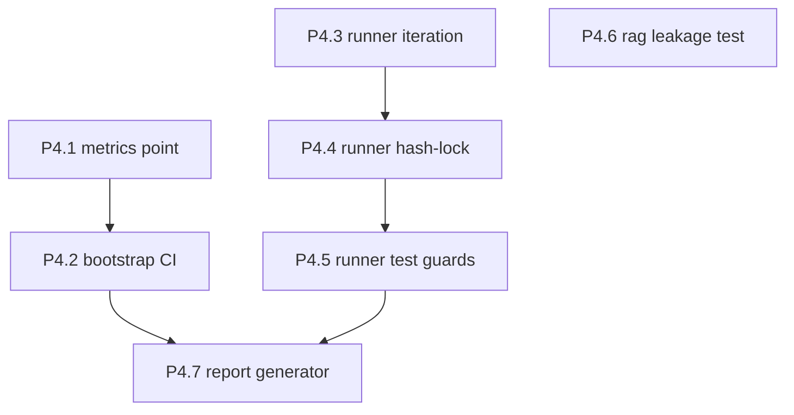
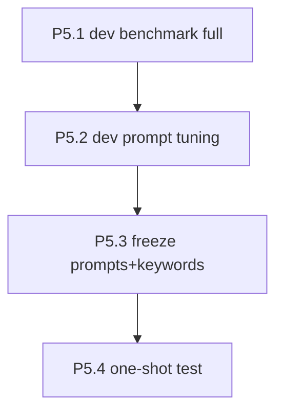

# Consensus Task Doc: 150-Bad-Case Framework

**Plan:** `.omc/plans/consensus-plan-150bad.md`
**Schema:** see plan §3.2 (task_id / phase / title / depends_on / files_touched / exit_test / estimate_h / owner_hint / status / notes)
**Status legend:** `todo` · `in_progress` · `blocked` · `done`
**Path convention:** all `files_touched` paths are relative to repo root (`E:/Studying Material/Capstone/agent`).

Total: 47 atomic tasks (P0: 3 · P1: 10 · P2: 15 · P3: 5 · P4: 7 · P5: 4 · P6: 3). Estimates sum to ~116 hours ≈ 14.5 full days (matches plan §8 lower bound).

---

## Phase 0 — Repo Reset & Scaffolding

| task_id | title | depends_on | files_touched | exit_test | est_h | owner | status |
|---|---|---|---|---|---|---|---|
| P0.1-tag-pre-rewrite | git tag rewrite 前的状态 | [] | [] | `git rev-parse v0.2-before-rewrite >/dev/null` | 0.25 | executor | todo |
| P0.2-rename-src-to-legacy | `src/` → `src_legacy/`;更新 pyproject 包路径 | [P0.1] | [src_legacy/, pyproject.toml] | `test -d src_legacy && test ! -d src && grep -q "agent" pyproject.toml` | 0.5 | executor | todo |
| P0.3-scaffold-new-src-tree | 创建新目录结构 + `__init__.py` stubs(含 `src/agent/`, `src/nodes/`, `src/adapters/`, `src/data/`, `src/eval/`, `src/baselines/`, `tests/unit/`, `tests/fixtures/verifier_verdicts/`, `tests/fixtures/baseline_sanity/`, `docs/graphs/`) | [P0.2] | [src/**, tests/**, docs/graphs/] | `venv/Scripts/python.exe -c "import agent.state; import agent.graph; import agent.nodes.analyst; import agent.adapters.llm" 2>&1 \| grep -v Error; test -d docs/graphs` | 1 | executor | todo |

**Phase 0 exit gate:** `venv/Scripts/python.exe -c "from agent.graph import build_graph_full"` 不报错(空 stub 允许)。

---

## Phase 1 — Dataset Construction & Split Lock

| task_id | title | depends_on | files_touched | exit_test | est_h | owner | status |
|---|---|---|---|---|---|---|---|
| P1.1-merge-and-dedupe-bad-cases | 合并 `vulnerabilities.json` + `vulnerabilities_pre.json`,按 `id` 去重 | [P0.3] | [scripts/build_eval_set.py, data/dataset/bad_cases.json] | `[ $(jq '.cases\|length' data/dataset/bad_cases.json) -ge 100 ]` | 2 | data-engineer | todo |
| P1.2-fill-missing-contract-source | 从 `data/contracts/raw/` 补齐空 `contract_source` case | [P1.1] | [scripts/build_eval_set.py, data/dataset/bad_cases.json] | `[ $(jq '.cases\|map(select(.contract_source==""))\|length' data/dataset/bad_cases.json) -eq 0 ]` | 3 | data-engineer | todo |
| P1.3-harvest-code4rena-extra-bad | 从 Code4rena/SWC 扩充到 ≥ 150 bad case | [P1.2] | [scripts/build_eval_set.py, data/dataset/bad_cases.json, data/contracts/raw/**] | `[ $(jq '.cases\|length' data/dataset/bad_cases.json) -ge 150 ]` | 16 | data-engineer | todo | notes: R11 标的风险项;若 > 7 天降级到 120(task 改为 ≥ 120)
| P1.4-construct-safe-from-fixed-code | 从 bad case 的 `fixed_code` 字段构造 safe(≤ 40% 占比) | [P0.3] | [scripts/build_eval_set.py, data/dataset/safe_cases.json] | `python scripts/build_eval_set.py --count safe_by_type | grep -E "fixed_code_safe\s+[0-9]+" | awk '{print $2}' | xargs -I{} test {} -le 20` | 2 | data-engineer | todo |
| P1.5-construct-safe-from-oz | 从 OpenZeppelin 合约库摘取 safe case(≥ 40% 占比) | [P0.3] | [scripts/build_eval_set.py, data/dataset/safe_cases.json] | `python scripts/build_eval_set.py --count safe_by_type | grep -E "oz_safe\s+[0-9]+" | awk '{print $2}' | xargs -I{} test {} -ge 20` | 3 | data-engineer | todo |
| P1.6-construct-safe-from-c4-invalid | 从 Code4rena invalid / no-impact issue 提取 safe(≥ 20% 占比) | [P0.3] | [scripts/build_eval_set.py, data/dataset/safe_cases.json] | `python scripts/build_eval_set.py --count safe_by_type | grep -E "c4_invalid_safe\s+[0-9]+" | awk '{print $2}' | xargs -I{} test {} -ge 10` | 4 | data-engineer | todo |
| P1.7-write-eval-set-schema | 定义 pydantic `Case` / `EvalSet`,合并 bad+safe → `eval_set.json`,每条加 `ground_truth_label`, `source_type`, `buildable`, `project_name` | [P1.3, P1.4, P1.5, P1.6] | [src/data/schema.py, scripts/build_eval_set.py, data/dataset/eval_set.json] | `python scripts/build_eval_set.py --validate` | 3 | data-engineer | todo |
| P1.8-validate-eval-set | 编译率 ≥ 90%;20 条人工 spot-check;强制字段齐全 | [P1.7] | [scripts/build_eval_set.py, data/dataset/eval_set.json] | `python scripts/build_eval_set.py --validate --strict && [ $(jq '.cases\|map(select(.buildable==true))\|length' data/dataset/eval_set.json) -ge $(( $(jq '.cases\|length' data/dataset/eval_set.json) * 9 / 10 )) ]` | 4 | data-engineer | todo |
| P1.9-stratified-split-dev-test | seed=42 stratified 75/25+75/25 切 `dev.json` / `test.json`;`split_seed.txt` | [P1.8] | [scripts/split_eval_set.py, scripts/verify_split_stratification.py, data/dataset/dev.json, data/dataset/test.json, data/dataset/split_seed.txt] | `python scripts/verify_split_stratification.py && [ $(jq '.cases\|length' data/dataset/dev.json) -ge 100 ] && [ $(jq '.cases\|length' data/dataset/test.json) -ge 100 ]` | 3 | data-engineer | todo |
| P1.10-write-dataset-hashes-lock | 计算 dev/test/seed sha256 → `.dataset_hashes.lock`;git commit 4 件 | [P1.9] | [scripts/split_eval_set.py, data/dataset/.dataset_hashes.lock] | `python -c "import hashlib,json; h=lambda p: hashlib.sha256(open(p,'rb').read()).hexdigest(); d=json.load(open('data/dataset/.dataset_hashes.lock')); assert d['dev']==h('data/dataset/dev.json') and d['test']==h('data/dataset/test.json') and d['seed']==h('data/dataset/split_seed.txt'), 'hash mismatch'"` | 1 | data-engineer | todo |

**Phase 1 exit gate:** ≥ 150 bad + ≥ 50 safe merged;dev + test each ≥ 100;stratification verified;hash lock committed.

---

## Phase 2 — Core Agent Implementation

| task_id | title | depends_on | files_touched | exit_test | est_h | owner | status |
|---|---|---|---|---|---|---|---|
| P2.1-state-schema-core-and-annotations | `AuditCore` TypedDict 10 字段(对齐 framework.md §4.1);`AuditAnnotations` TypedDict `total=False` 明确字段(`error_history: list[str]`, `tokens_prompt: int`, `tokens_completion: int`, `llm_calls: int`, `system_fingerprint: str`, `wall_clock_seconds: float`) — **非** bare `Dict[str, Any]`(Architect minor #1) | [P0.3] | [src/agent/state.py, tests/unit/test_state.py] | `pytest tests/unit/test_state.py -q` | 3 | executor | todo |
| P2.2-verifier-golden-fixtures | 写 ≥ 8 条真实 revert 字符串 fixtures(OZ v4, OZ v5 custom error, 自定义 error, 非英文, OOG, Panic, full pass, compile fail) | [P0.3] | [tests/fixtures/verifier_verdicts/*.txt, tests/fixtures/verifier_verdicts/*.json] | `[ $(ls tests/fixtures/verifier_verdicts/ | wc -l) -ge 8 ]` | 2 | test-engineer | todo |
| P2.3-test-verdict-classifier-red | 写 `test_nodes_verifier.py` fixture 驱动用例;故意让它全部失败(no impl 存在) | [P2.1, P2.2] | [tests/unit/test_nodes_verifier.py] | `pytest tests/unit/test_nodes_verifier.py -q; [ $? -ne 0 ]` | 2 | test-engineer | todo | notes: 必须先 red
| P2.4-implement-revert-keywords-yaml | 写 `revert_keywords.yaml` 覆盖 fixtures 里的 AC keyword | [P2.2] | [src/adapters/revert_keywords.yaml] | `python -c "import yaml; d=yaml.safe_load(open('src/adapters/revert_keywords.yaml')); assert 'access_control' in d and len(d['access_control']) >= 5"` | 1 | executor | todo |
| P2.5-implement-foundry-adapter | `foundry.py` 三类 verdict 分类器;从 yaml 读关键字 | [P2.4] | [src/adapters/foundry.py] | `python -c "from agent.adapters.foundry import classify_verdict; print(classify_verdict(open('tests/fixtures/verifier_verdicts/pass_withdraw_full.json').read()))" | grep -q pass` | 4 | executor | todo |
| P2.6-verifier-classifier-green | 让 P2.3 全绿 | [P2.3, P2.5] | [src/adapters/foundry.py] | `pytest tests/unit/test_nodes_verifier.py -q` | 1 | executor | todo |
| P2.7-static-analyzer-adapter | Slither + regex fallback;**内存源码优先**(tmpfile 调用) | [P2.1] | [src/adapters/static_analyzer.py, tests/unit/test_adapters_static.py] | `pytest tests/unit/test_adapters_static.py -q` | 4 | executor | todo |
| P2.8-rag-adapter-with-loo | Chroma 本地;语料 = `dev.json` vulnerable;评估 dev 时同 `case_id` LOO | [P2.1] | [src/adapters/rag.py, scripts/load_rag.py, tests/unit/test_adapters_rag.py] | `pytest tests/unit/test_adapters_rag.py -q` | 4 | executor | todo |
| P2.9-llm-adapter-with-fingerprint | `ChatOpenAI` pin snapshot + seed + temperature;响应 `system_fingerprint` 入 annotations | [P2.1] | [src/adapters/llm.py] | `python -c "from agent.adapters.llm import get_llm; c=get_llm(); m=c.invoke('hi'); print(m.response_metadata.get('system_fingerprint','NONE'))" | grep -v NONE` | 2 | executor | todo |
| P2.10-node-analyst | `analyst.py` 消费静态事实 + RAG few-shot,输出 JSON `{target_function, hypothesis, confidence, reasoning}` | [P2.7, P2.8, P2.9] | [src/nodes/analyst.py, tests/unit/test_nodes_analyst.py] | `pytest tests/unit/test_nodes_analyst.py -q` | 4 | executor | todo |
| P2.11-node-builder | `builder.py` 输入 target_function + hypothesis + error_history,输出 `.t.sol` | [P2.10] | [src/nodes/builder.py, tests/unit/test_nodes_builder.py] | `pytest tests/unit/test_nodes_builder.py -q` | 3 | executor | todo |
| P2.12-node-verifier | `verifier.py` 调 foundry adapter,返回三类 verdict + trace | [P2.6] | [src/nodes/verifier.py] | `python -c "from agent.nodes.verifier import verify_poc; print(verify_poc({'verification_poc':'pragma solidity 0.8.20; contract T{}','contract_source':'pragma solidity 0.8.20; contract X{}','contract_name':'X','retry_count':0,'max_retries':5})['execution_result'])" | grep -qE "pass\|fail"` | 2 | executor | todo |
| P2.13-graph-shared-subconstructors | `_add_verifier_loop(g)` / `_add_report_terminal(g)` / `_add_safe_terminal(g)`(Architect minor #2 消除复制) | [P2.11, P2.12] | [src/agent/graph.py] | `python -c "from agent.graph import _add_verifier_loop, _add_report_terminal, _add_safe_terminal; print('ok')"` | 2 | executor | todo |
| P2.14-four-compile-time-graphs | `build_graph_full` / `build_graph_no_static` / `build_graph_no_rag` / `build_graph_no_verify_loop`;导 mermaid 到 `docs/graphs/` | [P2.13] | [src/agent/graph.py, docs/graphs/full.mmd, docs/graphs/no_static.mmd, docs/graphs/no_rag.mmd, docs/graphs/no_verify_loop.mmd] | `python -c "from agent.graph import build_graph_full, build_graph_no_static, build_graph_no_rag, build_graph_no_verify_loop; [g().get_graph().draw_mermaid() for g in [build_graph_full,build_graph_no_static,build_graph_no_rag,build_graph_no_verify_loop]]" && [ $(grep -c verifier docs/graphs/no_verify_loop.mmd) -eq 0 ]` | 4 | executor | todo |
| P2.15-smoke-test-happy-unhappy | `scripts/smoke_test.py --graph {full,happy,fail_revert,fail_error}` 3 条样本 | [P2.14] | [scripts/smoke_test.py, tests/fixtures/smoke_contracts/*.sol] | `python scripts/smoke_test.py --graph full --contract tests/fixtures/smoke_contracts/demo_vuln.sol 2>&1 | grep -q "verdict: pass" && python scripts/smoke_test.py --graph full --contract tests/fixtures/smoke_contracts/demo_safe.sol 2>&1 | grep -q "verdict: fail_revert_ac"` | 3 | executor | todo |

**Phase 2 exit gate:** `pytest tests/unit/ -q` 全绿;smoke test 3 条全过;4 个 graph 独立 mermaid 且 `no_verify_loop.mmd` 不含 verifier。

---

## Phase 3 — Baselines

| task_id | title | depends_on | files_touched | exit_test | est_h | owner | status |
|---|---|---|---|---|---|---|---|
| P3.4-baseline-record-schema | 定义 `PredictionRecord` pydantic,含 `tokens_prompt`, `tokens_completion`, `llm_calls`, `wall_clock_seconds`, `flagged`, `flagged_functions` | [P2.1] | [src/baselines/__init__.py, src/data/schema.py] | `python -c "from baselines import PredictionRecord; PredictionRecord(case_id='x', flagged=True, flagged_functions=['f'], tokens_prompt=0, tokens_completion=0, llm_calls=0, wall_clock_seconds=0.1)"` | 1 | executor | todo |
| P3.1-slither-baseline | `slither --json` 跑 case;任一 AC detector → `flagged=True` | [P3.4] | [src/baselines/slither_baseline.py] | `python -c "from baselines.slither_baseline import evaluate_baseline; import json; c=json.load(open('data/dataset/dev.json'))['cases'][0]; r=evaluate_baseline(c); print(r.flagged)" | grep -qE "True\|False"` | 4 | executor | todo |
| P3.2-gpt4-zeroshot-baseline | 单 prompt;无静态、无 RAG、无 verify;记录 tokens | [P3.4] | [src/baselines/gpt4_zeroshot.py] | `python -c "from baselines.gpt4_zeroshot import evaluate_baseline; import json; c=json.load(open('data/dataset/dev.json'))['cases'][0]; r=evaluate_baseline(c); assert r.llm_calls==1 and r.tokens_prompt>0"` | 3 | executor | todo |
| P3.3-baseline-sanity-fixtures | 5 条人工已知标答 case(dev 子集或独立) | [P1.9] | [tests/fixtures/baseline_sanity/five_known_labels.json] | `[ $(jq '.cases\|length' tests/fixtures/baseline_sanity/five_known_labels.json) -eq 5 ]` | 1 | test-engineer | todo |
| P3.5-baseline-sanity-green | 两个 baseline 在 5 条 fixture 上各命中 ≥ 3 | [P3.1, P3.2, P3.3] | [tests/unit/test_baselines_sanity.py] | `pytest tests/unit/test_baselines_sanity.py -q` | 2 | test-engineer | todo |

**Phase 3 exit gate:** sanity test 两 baseline 各命中 ≥ 3;每条记录字段齐全。

---

## Phase 4 — Eval Runner + Metrics

| task_id | title | depends_on | files_touched | exit_test | est_h | owner | status |
|---|---|---|---|---|---|---|---|
| P4.1-metrics-point-estimates | `compute_contract_metrics`(TP/FP/TN/FN → P/R/F1)+ `compute_function_recall`(top-1) | [P0.3] | [src/eval/metrics.py, tests/unit/test_metrics.py] | `pytest tests/unit/test_metrics.py::test_point_estimates -q` | 3 | executor | todo |
| P4.2-metrics-bootstrap-ci | 每指标 95% bootstrap CI | [P4.1] | [src/eval/metrics.py, tests/unit/test_metrics.py] | `pytest tests/unit/test_metrics.py::test_bootstrap_ci -q` | 2 | executor | todo |
| P4.3-eval-runner-iteration | 迭代 case × arm;per-case JSON artifact;`--cases N --arms a,b` | [P2.14, P3.1, P3.2] | [src/eval/runner.py, scripts/run_eval.py] | `python scripts/run_eval.py --cases 5 --arms full --split dev && test -f data/evaluation/full.json` | 4 | executor | todo |
| P4.4-eval-runner-hash-lock | 启动时读 `.dataset_hashes.lock` 自检;不一致 abort(Architect minor #3 升级) | [P1.10, P4.3] | [src/eval/runner.py, scripts/run_eval.py] | `cp data/dataset/dev.json /tmp/dev.bak && echo "//tamper" >> data/dataset/dev.json && ! python scripts/run_eval.py --cases 1 --arms full --split dev 2>&1 | grep -q "hash mismatch"; mv /tmp/dev.bak data/dataset/dev.json` | 2 | executor | todo |
| P4.5-eval-runner-test-guards | `--split test` 必配 `--i-am-aware-this-opens-the-test-set`;`summary_test.md` 存在时拒绝,需 `--overwrite-test-i-accept-contamination`;append `test_run_history.jsonl`;首次 test 跑完扩展 hash-lock 涵盖 `revert_keywords.yaml` + prompt files(Critic v2 addendum) | [P4.4] | [src/eval/runner.py, scripts/run_eval.py] | `! python scripts/run_eval.py --cases 1 --arms full --split test 2>&1 \| grep -q "refuse: opening test" && python scripts/run_eval.py --cases 1 --arms full --split test --i-am-aware-this-opens-the-test-set && test -s data/evaluation/test_run_history.jsonl` | 3 | executor | todo |
| P4.6-rag-leakage-test | 枚举 RAG 索引;断言评估 dev case `C` 时 `C.id` 不在索引 | [P2.8] | [tests/unit/test_rag_leakage.py] | `pytest tests/unit/test_rag_leakage.py -q` | 2 | test-engineer | todo |
| P4.7-report-summary-generator | 聚合 6 arm → `summary_dev.md` / `summary_test.md`;列含 tokens/llm_calls/P/R/F1/Func-R/Avg Retries + CI | [P4.2, P4.5] | [src/eval/report.py, scripts/run_eval.py] | `python scripts/run_eval.py --cases 20 --arms full,baseline_slither --split dev && test -s data/evaluation/summary_dev.md && grep -q "Tokens" data/evaluation/summary_dev.md` | 3 | executor | todo |

**Phase 4 exit gate:** 手动篡改 dev.json → runner abort;rag leakage test 绿;20-case smoke 产出合规 summary_dev.md。

---

## Phase 5 — DEV Iteration + One-shot TEST

| task_id | title | depends_on | files_touched | exit_test | est_h | owner | status |
|---|---|---|---|---|---|---|---|
| P5.1-dev-benchmark-full-arm | 跑 `full` 全 dev,产出 `summary_dev.md` + failure-category 分析 | [P4.7] | [data/evaluation/full.json, data/evaluation/summary_dev.md, docs/DEV_ITERATION_LOG.md] | `python scripts/run_eval.py --arms full --split dev && test -s data/evaluation/summary_dev.md` | 3 | executor | todo |
| P5.2-dev-iteration-prompt-tuning | 迭代 prompt / few-shot / keyword yaml;每次 commit + DEV_ITERATION_LOG 一行;dev 冲到 P/R/F1 ≥ 0.60 且 Func-R ≥ 0.35 | [P5.1] | [src/nodes/analyst.py 的 prompt, src/nodes/builder.py 的 prompt, src/adapters/revert_keywords.yaml, docs/DEV_ITERATION_LOG.md] | `python scripts/run_eval.py --arms full --split dev && python scripts/check_dev_thresholds.py --min-p 0.60 --min-r 0.60 --min-f1 0.60 --min-func-r 0.35` | 12 | executor | todo | notes: timebox 12h;用完即进 P5.3
| P5.3-freeze-prompts-and-keywords | 把 prompt 文件 + keywords yaml hash 加入 `.dataset_hashes.lock` 的 prompt 部分 | [P5.2] | [data/dataset/.dataset_hashes.lock] | `python scripts/freeze_artifacts.py --prompts-and-keywords && python -c "import json; d=json.load(open('data/dataset/.dataset_hashes.lock')); assert 'prompts' in d and 'keywords' in d"` | 1 | executor | todo |
| P5.4-test-one-shot-run | 一次性跑 6 arms × test;产 `summary_test.md` | [P5.3] | [data/evaluation/*.json, data/evaluation/summary_test.md, data/evaluation/test_run_history.jsonl] | `python scripts/run_eval.py --arms full,no_static,no_rag,no_verify_loop,baseline_slither,baseline_gpt4 --split test --i-am-aware-this-opens-the-test-set && [ $(git log --all --oneline -- data/evaluation/summary_test.md | wc -l) -le 1 ] && python scripts/check_test_thresholds.py --min-p 0.55 --min-r 0.55 --min-f1 0.55 --vs-slither-min-delta 8 --no-verify-loop-min-drop 5` | 6 | executor | todo |

**Phase 5 exit gate:** `summary_test.md` 存在且 git history 仅一次 commit;test 阈值全过。

---

## Phase 6 — Docs & Reproducibility

| task_id | title | depends_on | files_touched | exit_test | est_h | owner | status |
|---|---|---|---|---|---|---|---|
| P6.1-architecture-doc | mermaid 架构图(4 graph) + state schema 字段表 + 节点契约 | [P2.14] | [docs/ARCHITECTURE.md] | `grep -q "AuditCore" docs/ARCHITECTURE.md && grep -q "build_graph_full" docs/ARCHITECTURE.md` | 2 | writer | todo |
| P6.2-run-doc-windows-linux | Windows + WSL 安装步骤;`run_eval.py` 用法;"best-effort reproducibility modulo `system_fingerprint`" 声明 | [P5.4] | [docs/RUN.md] | `grep -q "system_fingerprint" docs/RUN.md && grep -q "WSL" docs/RUN.md && grep -q "run_eval.py" docs/RUN.md` | 2 | writer | todo |
| P6.3-dataset-doc | 150 bad + 50 safe 来源清单;`split_seed=42` + stratification 证据;`project_name` 不跨侧检测结果 | [P1.10] | [docs/DATASET.md] | `grep -q "split_seed" docs/DATASET.md && grep -q "stratif" docs/DATASET.md` | 2 | writer | todo |

**Phase 6 exit gate:** 干净 WSL Ubuntu 22.04 + 干净 Windows 11 各执行 `docs/RUN.md` 到 `summary_test.md` 能通(手动端到端验证)。

---

## Aggregate

- Total tasks: **47**
- Total estimate: **~116 h** ≈ 14.5 full-time days
- Critical path(最长依赖链):`P0.1 → P0.2 → P0.3 → P1.1 → P1.2 → P1.3 → P1.7 → P1.8 → P1.9 → P1.10 → P4.4 → P4.5 → P4.7 → P5.1 → P5.2 → P5.3 → P5.4 → P6.2`
- 可并行:P1.4–P1.6(safe 三路)、P2.2 与 P2.7/P2.8/P2.9、P3.1 与 P3.2、P6.1/P6.3
- Phase 5 `P5.2-dev-iteration-prompt-tuning` 是 timebox 任务(12 h),不是可无限迭代;用完即进 P5.3

## Downstream Hand-off

- 此 task 文档直接可被 `Skill("oh-my-claudecode:team")` 或 `Skill("oh-my-claudecode:ralph")` 消费
- 每个任务的 `exit_test` 字段是 orchestrator 判定 done 的唯一依据
- 状态字段在执行过程中由 executor/team agent 更新;`blocked` 必须同时更新 `notes` 说明阻塞原因
