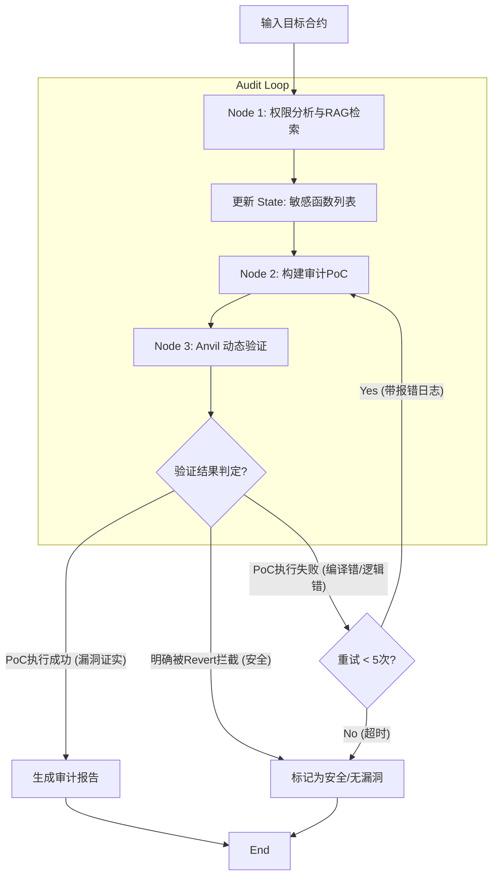

根据您提供的文件内容，以下是整理好的 Markdown 格式文档。

***

# Agent Framework

## 1. 架构选择

**A1 的核心逻辑**是“假说-验证-修正”循环。LangGraph 原生支持这种循环图（Cyclic Graph）结构，能精确控制 Agent 在什么条件下回到“修改代码”节点。

*   **节点 (Nodes)**：设立“分析代理”、“漏洞编写代理”、“执行环境（沙盒）”等节点。
*   **边 (Edges)**：当沙盒反馈“执行失败”时，通过一条条件边将错误信息传回“编写代理”进行 Refine。
*   **状态存储**：自动保存之前的尝试记录，避免 Agent 犯同样的错误。

### 框架对比概览

| 维度         | LangGraph                    | CrewAI                         | AutoGen                                 | Plain LangChain                                 |
| :----------- | :--------------------------- | :----------------------------- | :-------------------------------------- | :---------------------------------------------- |
| **设计逻辑** | 基于状态机/图，精准控制流程  | 基于角色和任务分配             | 基于 Agent 间的对话和协作               | 传统的链式处理                                  |
| **循环能力** | **极强**，原生支持复杂循环   | 较强，主要通过 Sequential 任务 | 强，通过对话反复修正                    | **不支持**，DAG（有向无环图），只能一条路走到黑 |
| **学习曲线** | 较陡（需要理解图逻辑）       | 简单（配置角色和任务即可）     | 中等                                    | -                                               |
| **最佳用途** | 复杂的工业级闭环安全审计系统 | 快速原型或模拟团队协作流程     | 需要 Agent 频繁交流、自主运行代码的场景 | 适合单向任务                                    |

### 核心维度详细对比

| 核心维度                                             | LangGraph (最佳方案)                                                                             | CrewAI                                                                | AutoGen                                                                                | Plain LangChain                                                   |
| :--------------------------------------------------- | :----------------------------------------------------------------------------------------------- | :-------------------------------------------------------------------- | :------------------------------------------------------------------------------------- | :---------------------------------------------------------------- |
| **1. 循环能力**<br>(A1 核心: 报错→修改→重试)         | **原生支持 (Native)**<br>专为循环图设计，轻松定义“失败则跳回 Node 2”的条件边。                   | **弱 (Weak)**<br>主要是线性的 Process，实现复杂的“条件回滚”比较别扭。 | **基于对话 (Conversational)**<br>靠 Agent 互相说话来循环，流程不可控，容易陷入死循环。 | **不支持 (None)**<br>无法实现 A1 的迭代闭环。                     |
| **2. 状态管理**<br>(A1 需传递: 源码, 报错, 尝试次数) | **全局共享状态 (Shared State)**<br>所有节点读写同一个 Schema，像传接力棒一样传递数据，结构清晰。 | **上下文传递 (Context)**<br>基于文本传递，对结构化数据管理较弱。      | **对话历史 (History)**<br>状态混在聊天记录里，Token 消耗巨大且易丢失重点。             | **内存 (Memory)**<br>简单的键值对存储，难以处理复杂工程状态流转。 |
| **3. 执行确定性**<br>(A1 需: 严格控制重试 5 次)      | **高 (High)**<br>可用 Python 代码精确控制逻辑 (如 `if retries > 5: return End`)。                | **中 (Medium)**<br>偏向让 Agent 自己决定，容易“跑偏”。                | **低 (Low)**<br>Agent 极其自主，很难强制严格按步骤执行。                               | **高 (High)**<br>非常确定，但太死板，缺乏动态调整能力。           |
| **4. 工具集成**<br>(A1 的手: Foundry/Slither)        | **节点级控制 (Node-level)**<br>在特定 Node 完美封装 Python 函数调用，易于调试。                  | **Tool 抽象**<br>集成容易，但很难控制 Agent 何时必须用哪个工具。      | **代码执行器**<br>强项是写代码运行，但在集成特定安全工具流时，不如图结构清晰。         | **Tool 调用**<br>支持，但缺乏上下文感知的复杂调用逻辑。           |

### 结论
*   ✅ **LangGraph**：完美复现 A1 的“状态机”本质。
*   ❌ **CrewAI**：适合“模拟人类团队开会”，不适合“精密的代码工程”。
*   ⚠ **AutoGen**：适合“探索性实验”，但在生产环境难以落地（不可控）。
*   ❌ **Plain LangChain**：无法处理闭环逻辑。

---

## 2. Dataset 集成到 Agent 中

### 集成模式
1.  **RAG 增强 (知识库模式)**：将“漏洞代码”和“成功 Exploit”存入向量数据库。Agent 拿到待测合约时，搜索相似案例学习攻击手法。
2.  **Few-Shot 提示工程 (样本模式)**：挑选 3-5 个典型漏洞案例 (CVE/CWE) 作为 Prompt 上下文，指导 Agent 生成精准代码。
3.  **自动化验证 (评估模式)**：构建 Assessor/Verifier 节点，对比 Agent 结果与数据集中的 Ground Truth。

### 推荐工具合集

| 环节               | 推荐工具             | 作用                                                   |
| :----------------- | :------------------- | :----------------------------------------------------- |
| **多代理编排**     | LangGraph            | 控制“分析-尝试-验证”的闭环逻辑。                       |
| **漏洞知识存储**   | Pinecone / Milvus    | 存储漏洞数据集，实现语义搜索增强。                     |
| **底层仿真实验室** | Foundry (Anvil/Cast) | 基于数据集提供的块高度，开启 Local Fork 进行实战演练。 |
| **静态引导分析**   | Slither / Aderyn     | 结合数据集特征，提供初始的静态分析结果。               |

---

## 3. 基准测试与评估

*   **核心指标**：关注 Agent 的 **召回率 (Recall)**（找出了多少漏洞）和 **准确率 (Precision)**。
*   **安全环境**：参考 CVE-Bench 的沙盒设计，确保 Agent 在容器化（Docker）环境中安全执行攻击代码，防止损坏主机系统。

---

## 4. 系统构建 (System Construction)

### 第一层：定义“共享状态” (The State Schema)
这是系统的“内存”，在 LangGraph 各个节点间流转。

```python
from typing import TypedDict, List, Dict, Optional

class AuditGraphState(TypedDict):
    # --- 1. 上下文输入 (Context) ---
    contract_source: str       # 目标合约源码
    contract_abi: List         # 目标合约 ABI

    # --- 2. 静态分析结果 (Node 1 产出) ---
    # 识别出的角色 (如 Owner, Admin) 和修饰符 (Modifiers)
    defined_roles: List[str]
    # 待审计的敏感函数列表，包含函数名、签名及理论上的权限要求
    # 例: [{"name": "setFee", "signature": "0x...", "expected_role": "Owner"}]
    sensitive_functions: List[Dict]

    # --- 3. 验证过程 (Node 2 & 3 交互) ---
    # 审计假说：Agent 怀疑哪里存在越权风险
    # 例: "Function 'initialize' is public and lacks 'initializer' modifier."
    audit_hypothesis: str

    # 最小验证用例 (PoC)：Foundry 测试脚本，用于证明权限失效
    # 注意：不再是 Exploit，而是 Evidence Code
    verification_poc: str

    # 执行轨迹：Anvil 的 trace 或 console.log 输出
    execution_trace: str

    # --- 4. 最终结论 (Output) ---
    retry_count: int           # 当前尝试迭代次数
    finding_confirmed: bool    # 是否确认存在漏洞 (True = 审计不通过)
    audit_report: Dict         # 结构化的漏洞报告 (位置、类型、证据)
```


### 第二层：设计“核心节点” (The Worker Nodes)

#### Node 1: 权限模式分析师 (Access Control Analyst)
*   **职责**：静态分析与模式识别。
*   **输入**：`contract_source` + RAG 向量库 (C5 数据集)。
*   **动作**：
    *   角色提取 (`onlyOwner`, `AccessControl`)。
    *   敏感点扫描 (State-Changing 函数如 `mint`, `upgradeTo`)。
    *   模式匹配 (对比数据集中的漏洞模式)。
*   **输出**：更新 `sensitive_functions` 和 `audit_hypothesis`。

#### Node 2: 证据构建器 (Evidence Builder)
*   **职责**：编写最小验证单元测试 (Unit Test Generator)。
*   **输入**：`sensitive_functions` + `audit_hypothesis`。
*   **动作**：编写 Foundry (`.t.sol`) 测试脚本。
    *   **核心逻辑**：Setup (部署) -> Actor (创建未授权地址) -> Action (模拟调用) -> Assertion (断言状态变化或未 Revert)。
*   **代码示例 (Solidity)**：
    ```solidity
    function test_PrivilegeEscalation() public {
        address stranger = address(0x123);
        vm.prank(stranger);
        // 尝试调用只有管理员能调用的函数
        targetContract.setProtocolFee(100);
        // 审计标准：如果上述调用没有 Revert，且状态确实变了，则漏洞存在
        assertEq(targetContract.fee(), 100, "Access Control Failed: Unauthorized user changed fee");
    }
    ```
*   **输出**：更新 `verification_poc`。

#### Node 3: 动态验证器 (Dynamic Verifier)
*   **职责**：执行测试并解析结果 (The Ground Truth Checker)。
*   **输入**：`verification_poc`。
*   **动作**：
    *   在 Anvil 本地分叉环境运行 `forge test --json`。
    *   **解析日志**：
        *   `PASS`：漏洞证实 (未授权操作成功)。
        *   `FAIL` (Revert: caller is not owner)：安全 (权限控制生效)。
        *   `FAIL` (编译/逻辑错误)：PoC 写错，需重试。
*   **输出**：更新 `execution_trace` 和 `finding_confirmed`。

### 第三层：构建“控制流” (The Control Flow)
利用 LangGraph 的 `Conditional Edge` 实现闭环。

1.  **分支 A：漏洞证实 (Vulnerability Confirmed)**
    *   **条件**：Node 3 返回 `PASS`。
    *   **动作**：生成包含漏洞位置、修复建议、复现代码的报告 -> **END**。
2.  **分支 B：修正证据 (Refine Evidence)**
    *   **条件**：Node 3 返回 `FAIL` (非权限拦截错误) 且 `retry_count < MAX_RETRIES`。
    *   **动作**：将报错信息喂回 LLM -> **回到 Node 2**。
3.  **分支 C：排除风险 (Risk Dismissed)**
    *   **条件**：Node 3 明确返回“权限拦截 Revert” 或 重试次数超标。
    *   **动作**：输出“安全/无法生成证据” -> **END**。

### 第四层：数据集的“特殊工位”

1.  **RAG 知识增强 (Input Side)**：Node 1 分析时检索最相似的历史漏洞模式作为 Few-Shot Context。
2.  **自动化评估/回归测试 (Output Side)**：
    *   抽取 50 个已知漏洞合约。
    *   计算 Recall (是否检出) 和 Proof Quality (PoC 是否能跑通)。
    *   错题分析：分析是 Node 1 漏找还是 Node 2 写错。

---

## 5. 架构总结图


